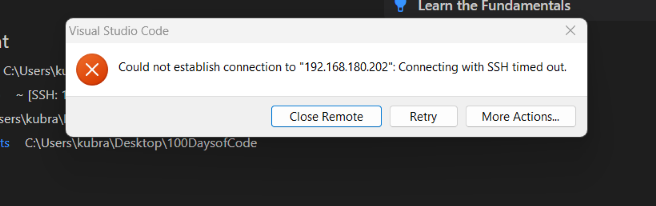
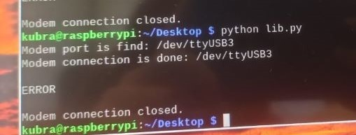
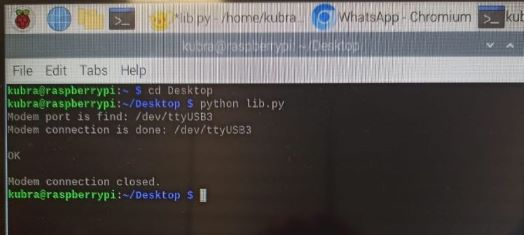

# Week3 Report
## Coding on Raspberry Pi Remotely with VS Code

* I was using VNC to connect to raspberyy pi remotely. This week I learned how to connect to raspberry pi with ssh via visual studio code. First I used an application to find the raspberry pi IP address. Then I followed the steps as I learned from the sources I used.  
* I downloaded the "Remote-SSH extension" to visual studio code.
* `ssh kubra@IP*` 
    * I made the connection with the code above.

* At the beginning I connected without any problems and started coding, but in the following days I tried to connect several times but it didn't work. I got a timeout error every time.

* References: 
    * [Coding on Raspberry Pi Remotely with VS Code](https://singleboardblog.com/coding-on-raspberry-pi-remotely-with-vscode/)
    * More details about this topic on this [site](https://randomnerdtutorials.com/raspberry-pi-remote-ssh-vs-code/)
    * [Advanced IP scanner](https://www.advanced-ip-scanner.com/)

## Markdown

* Previously, I was creating the markdown file from stack edit but I couldn't add images. This week I learned how to use the markdown format in visual studio code and add images.

* References: 
    * [How to use markdown in vscode](https://jaleyerdelen.medium.com/vscode-i%CC%87%C3%A7erisinde-markdown-nas%C4%B1l-kullan%C4%B1l%C4%B1r-b5e7fd5e482c)

## Python Library to Communicate with Modem

* Import the required libraries:
    * `import serial`
    * `import time`
    * `from serial.tools import list_ports`

* I created the class named "ModemController" in lib.py file

* The functions that I made: 
    * available_port()
        * This function checks if a suitable port is found. If a suitable port is not found or the connection cannot be established, the program will print an error message.
        * This function uses a specific port if it is already available, otherwise it tries all ports and selects it when it finds one available.
        * `list_ports.comports()` :It lists all serial ports connected to your computer and can be used to print the port name (device), description and hardware ID (hwid) for each one. I used port name (device) in my code.
    * test_connection()
        * Sends an AT command to a specific port and checks for an "OK" response. If "OK" is received, it assumes that the port is available to communicate with the modem and selects that port.
    * open_connection()
        * Opens a serial connection with a cellular modem.
        * If a specific port is available and the connection through this port has been successfully tested, the connection through this port is opened.
        * If no specific port is available or no suitable port is found, an error message is printed.
    * send_at_com()
        * This function sends at commands
        * `self.serial_connection.read_all().decode()`: All data written to the serial port is read and the data is parsed by converting the byte array to string. 
    * close_connection()
        * If a serial connection has been opened, this connection is closed and a message is printed after closing.
        

* I also created a main function in main.py file

* When I ran the code I got the following error

* I realized that the error was caused by the `time.sleep(1)`code in the send_at_com function and when I changed this code to `time.sleep(5)` the error was solved.

* References:
    * [pySerial documentation](https://pythonhosted.org/pyserial/index.html)
    * [Python serial communicaiton](https://devtut.github.io/python/python-serial-communication-pyserial.html#initialize-serial-device)