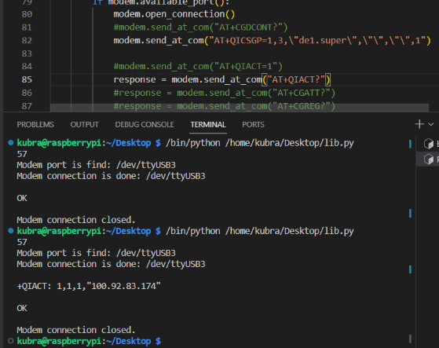
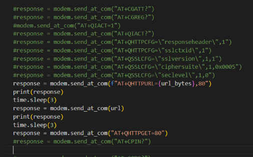
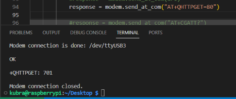
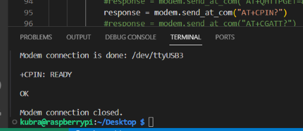

## WEEK 3 REPORT

### HTTP GET-POST

* This week I first found a document for HTTP request and reviewed this document. I started by researching and experimenting with the commands given in the document.
* I learned the APN with `modem.send_at_com("AT+CGDCONT?")` command and used it in the next command.
* I tried the parameters required for GPRS connection with `modem.send_at_com("AT+QICSGP=1,3,\"de1.super\",\"\",\"\",\"\",1")` command.
* `AT+QIACT`
    * After this command, I got an error and I searched for it. Again I tried the way I found in the document. I struggled with the solution of this error for a while.
    * I tried the `AT+CGATT?` command to see if the modem is connected to the GPRS network and got AT+CGATT: 1.
    * With the `AT+CGREG?` command, I got +CGREG=0,5. I learned that this output means "Not registered, searching".
    * When I activated the context with `modem.send_at_com("AT+QIACT=1")` command, the problem was solved. But this problem took a lot of time and slowed down my progress in the project.

    

* Other commands I tried:

	* `modem.send_at_com("AT+QIACT?")`
	* `modem.send_at_com("AT+QHTTPCFG=\"responseheader\",1")`
	* I set SSL context ID with `modem.send_at_com("AT+QHTTPCFG=\"sslctxid\",1")` command
	* `modem.send_at_com("AT+QSSLCFG=\"sslversion\",1,1")`
        * I set the SSL version to TLS 1.0. I learned that TLS is transport layer security and is used to provide secure data transmission.
	* `modem.send_at_com("AT+QSSLCFG=\"ciphersuite\",1,0x0005")`
	* `modem.send_at_com("AT+QSSLCFG=\"seclevel\",1,0")`
	* `modem.send_at_com(f"AT+QHTTPURL={url_bytes},80")`
        * I specified the URL byte length and the duration I want to access.
	* `modem.send_at_com(url)`
        * I specified the URL of the site I wanted to access.
	* `modem.send_at_com("AT+QHTTPGET=80")`

    
    
    * Here I got an error with the command `AT+QHTTPGET=80`.

    

    * In the manual I tried the command `modem.send_at_com("AT+CPIN?")` and found out that the sim card is ready to use.

    

    * But when I sent the HTTPGET request again, I got an error.
    
### References:
* [Quectel_LTE_Standard_HTTP(S)_Application_Note_V1.1](https://www.quectel.com/download/quectel_lte_standard_https_application_note_v1-1)
* [webhook.site](http://webhook.site) 

