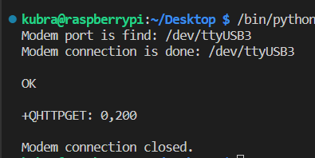
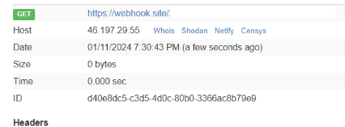
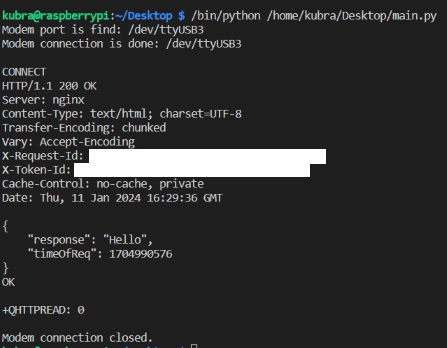
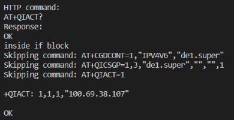
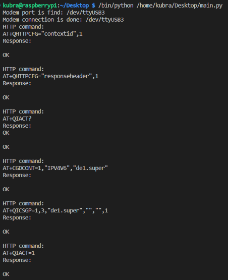
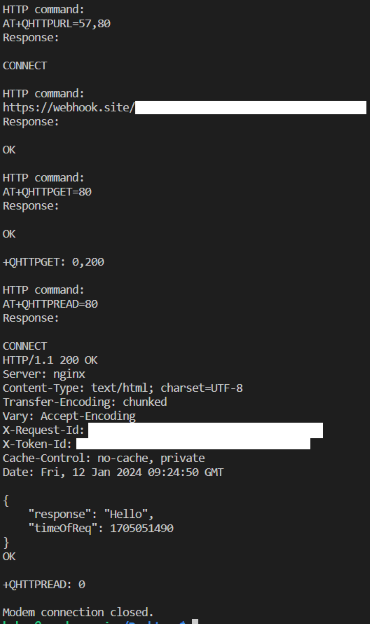
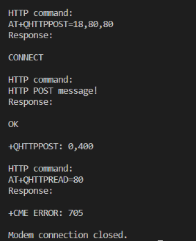

## WEEK 5 REPORT

### HTTP GET-POST

* Last week I had an 'Unknown error' but this week I made progress.
* First I made all the connections using AT commands for HTTP GET and the `send_at_com()` function I wrote. I sent an HTTP GET request to [webhook.site](http://webhook.site).
* All procedures were successful.

* I also read the response with HTTP read.

### Library Revision

* I put the commands for http get request in `get_arr` array to avoid manually entering all commands in order when sending an HTTP command.

* I also wrote the `http_get()` function to run these commands in order. 
    * I used the get_arr array in this function to print the commands.
    * I sent the array to the send_at_com() function and printed the responses I received in order.
    * If 'OK' is returned from the `AT+QIACT?` command, it does not execute the next 3 commands and moves on to the next commands. The purpose of this is to prevent it from reconnecting if there is already a connection. Because if it tries to reconnect, it will return 'ERROR'.
    * These 3 commands are:
        * `AT+CGDCONT=1,\"IPV4V6\",\"de1.super\"`
        * `AT+QICSGP=1,3,\"de1.super\",\"\",\"\",1`
        * `AT+QIACT=1`

        

    * In order to do this, I split the array returned as the answer with split() and got rid of the spaces with strip(). This way I was able to get the answer I wanted.

 

* For http post, I created an array named post_arr and added the commands required for post to this array. In this array, I also specified the message to be sent with post and its length.
* For HTTP post request, I wrote a function called `http_post()`. I used the post_arr[] array in this function.
* I received an error when sending HTTP post: 

