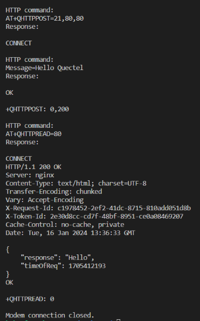
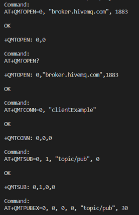
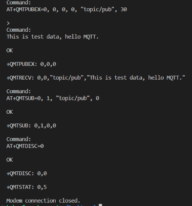

## WEEK 6 

### HTTP POST 
* Last week I got an error when sending an http post. This week I tried all the commands from the beginning using the function I wrote.
* I got a successful return as `+QHTTPPOST: 0,200`.

### MQTT CONNECTION

* First of all, I found a document for MQTT connection. I analyzed the document I found. I learned what the AT commands related to MQTT are and how to use them.
* I tried to understand how I can publish and subscribe via [hivemq](https://www.hivemq.com/mqtt/public-mqtt-broker/). I got the host name and port parameters necessary to do this.
* I added the host name and port I got from the broker along with the client id to the `AT+QMTOPEN` command and opened the network. I got the success message `+QMTOPEN: 0,0` as a return.
* Then I connected to the MQTT server. For this I used the `AT+QMTCONN` command and used the example in the document. I did not set a password for the connection.
* Then I subscribed to a topic with `AT+QMTSUB` command. 
* `With the `AT+QMTPUBEX` command, I typed the command to send a message by specifying the topic I subscribe to. In this command, I also specified the length of my message. Then I sent my message.
* I received feedback that my package had been sent successfully.
    * `+QMTPUBEX: 0,0,0`
* In addition, I received the message `+QMTRECV: 0,0, "This is test data, hello MQTT.
* After all the operations, I closed the connection with `AT+QMTDISC=0` command. 
* I added a function to my library for MQTT commands and edited it.  

### PPP PROTOCOL 
* First of all, I did some research about the ppp protocol. The sites I reviewed:
    * [Cellular Internet Connection](https://docs.sixfab.com/page/tutorials)
    * [PPP connection](https://docs.sixfab.com/page/setting-up-the-ppp-connection-for-sixfab-shield-hat)
* The PPP protocol is widely used for going online, but it is an old protocol.
* One of the problems with this protool is that the connection can be lost when sending AT commands. When PPP connection is established, it switches to data mode and AT commands do not work in this mode. For this, it is necessary to switch to command mode again.
* Here are some commands I just learned:
    * The `ATE0^M` command is used to set the visibility (echo) of the command in the response after the sent command.(0:not visible)
    * The `ATD*99#^M` command is used to establish the ppp connection.  
