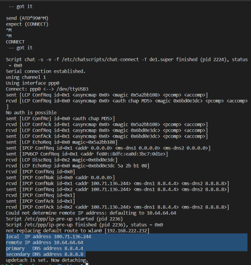
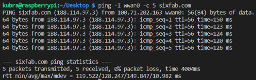

# WEEK 7 REPORT

## Connecting Raspberrypi to Internet via Protocols

### 1) PPP Protocol 
* I followed the [PPP Connection](https://docs.sixfab.com/page/setting-up-the-ppp-connection-for-sixfab-shield-hat) site to establish the connection.
* First of all, since the PPP protocol is installed over the serial port of the modem, some configurations were made.
    *  The command `AT+QCFG="usbnet"` was used. The response from this command was `+QFCG: "usbnet",1`, so I sent the command `AT+QCFG="usbnet",0`. 
    * 10 seconds after this command I restarted the module with `AT+CFUN=1,1` command.

     

* After the configuration part, I downloaded the repository in the document for PPP connection. 
```
git clone https://github.com/sixfab/Sixfab_PPP_Installer.git 
cd Sixfab_PPP_Installer 
chmod +x ppp_install.sh
sudo ./ppp_install.sh
```

* After this step, I selected the sixfab LINE, APN, username, password and communication port respectively and completed the download process.


* After rebooting, I connected to the internet with `sudo pon` command.



* I checked the connection with `ifconfig ppp0` and `ping -I ppp0 -c 5 sixfab.com`.


* Finally, I tested the internet speed. 
    

### 2) ECM Protocol
* I used the [ECM Protocol](https://docs.sixfab.com/page/cellular-internet-connection-in-ecm-mode) document.
* For this protocol, I first checked the USB devices with the `lsusb` command.
* I also checked USB devices and drivers with `lsusb -t` command.
* In the next steps, I did APN configuration using AT commands, modem configuration and then rebooted the modem.
    ```
    AT+CGDCONT=1,"IPV4V6","de1.super"
    AT+QCFG="usbnet",1
    AT+CFUN=1,1
    ```
* After the reboot I tested the internet connection with `ifconfig usb0` and `ping -I usb0 sixfab.com -c 5`.

 

* Finally, I also tested the internet speed. 


### 3) QMI Protocol

* This protocol also requires some configuration first. These are the same AT commands used to configure the PPP protocol.
    * Since `AT+QCFG="usbnet"` returns 0, the module configuration is complete.
    * I rebooted the module with `AT+CFUN=1,1` command and proceeded to the download step. 
* I followed the steps in the document for downloading.
* I downloaded the necessary packages.
    * `sudo apt update && sudo apt install libqmi-utils udhcpc`
* I checked the readiness of the module.
    * `sudo qmicli -d /dev/cdc-wdm0 --dms-get-operating-mode`
    * This command gave an error. First I checked the usb device and drivers with `lsusb -t` and realized that this was not the problem. Then I did some research on this. After rebooting the raspberry pi, I did the same thing again and the problem was solved.
    
     

* I configured the network.
    
    ```
        sudo ip link set wwan0 down
        echo 'Y' | sudo tee /sys/class/net/wwan0/qmi/raw_ip
        sudo ip link set wwan0 up
        sudo qmicli -d /dev/cdc-wdm0 --wda-get-data-format
    ```

* I got error after `sudo qmicli -d /dev/cdc-wdm0 --wda-get-data-format`.
    * First I rebooted the raspberry pi, but that didn't solve the problem.
    
    
    * Then I [researched](https://bugs.freedesktop.org/show_bug.cgi?id=98450) the error I was getting and found out that it could be caused by another process (e.g. ModemManager) using the QMI port.
    * I turned off ModemManager using the `sudo systemctl disable ModemManager.service` command. After doing the steps again, the problem was solved.
    
    

* I configured the APN and set the APN as 1.super and deleted the username and password parameters. 
    * `sudo qmicli -p -d /dev/cdc-wdm0 --device-open-net='net-raw-ip|net-no-qos-header' --wds-start-network="apn='de1.super',ip-type=4" --client-no-release-cid`

    

* I configured the IP. 
    * `sudo udhcpc -q -f -i wwan0`

    

* I tested the QMI connection.
    * `ifconfig wwan0`
    * `ping -I wwan0 -c 5 sixfab.com`

     

* Finally, I ran a speed test. 


### Comparison of Protocols

* My conclusions:
    * PPP upload speed: 5.85 Mbit/s
    * ECM upload speed: 2.17 Mbit/s
    * QMI upload speed: 2.62 Mbit/s

